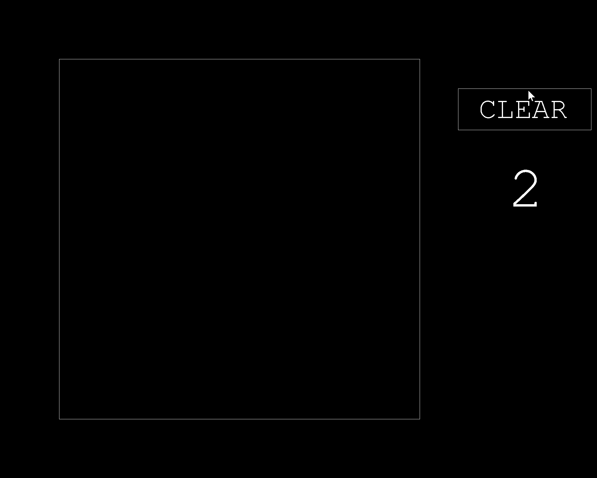

# handwritten-digits-classifier

This is a program that lets you write your own decimal digit and have it be classified using a neural network trained using a handwritten digit dataset provided by MNIST.

## Keyboard Shortcuts
Once the program is running, there are a few keyboard shortcuts you can use.
### Numbers *"1"* to *"9"*
Pressing any of the number keys will train the neural network on the current image on the screen to the number you pressed. This is done using backpropagation.

### The *"backspace"* key
The *"backspace key"* is a shortcut to clear the image on the screen.

### The letter *"T"*
Pressing the letter *"T"* **t**ests the current network on 10,000 testing examples provided by MNIST and prints the accuracy of the network.

### The letter *"S"*
The letter *"S"* will **s**ave and update the neural network file.
**NOTE:** this will override the neural network file.
